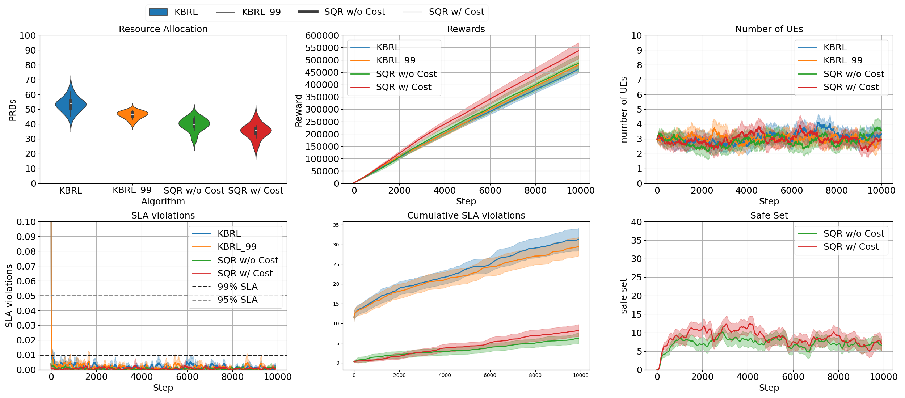

# ネットワークスライシング環境

## 📚 ドキュメント

このリポジトリを使い始める前に、以下のドキュメントを参照してください：

| ドキュメント | 内容 |
|---|---|
| [CODEBASE_GUIDE.md](./CODEBASE_GUIDE.md) | コードベース全体の解説（研究初心者向けの背景知識・アルゴリズム解説を含む） |
| [SETUP_WITH_UV.md](./SETUP_WITH_UV.md) | uv 仮想環境でのセットアップ・実行手順 |

---

## 概要

本コードは、論文「[Model-Based Reinforcement Learning with Kernels for Resource Allocation in RAN Slices](https://doi.org/10.1109/TWC.2022.3195570)」（IEEE Transactions on Wireless Communications 掲載）のソースコードです。複数のネットワークスライスに対して時間・周波数リソースを連続的に割り当てるネットワークスライシング環境を提供します。

この環境は OpenAI Gym インターフェース（https://github.com/openai/gym）を実装しており、Stable-Baselines RL エージェント（https://github.com/hill-a/stable-baselines）および Keras-RL エージェント（https://github.com/keras-rl/keras-rl）と連携できます。また、新しいモデルベース RL 制御アルゴリズム（KBRL）も含まれています。

各意思決定ステージでは、制御エージェントはシステムの状態を表す変数群を観測し、その観測に基づいて、次の複数の無線フレーム（観測期間）における各スライスへのリソースブロック（RB）割当を決定します。観測期間の終了時に、エージェントはその期間における各スライスの SLA（サービスレベルアグリーメント）の達成・違反を示すシグナルを受け取ります。エージェントの目的は、各スライスの SLA を満たしながら、使用する RB 数を最小化すること（効率的なリソース利用）です。


## 謝辞

本研究は、MICIU / AEI / 10.13039/501100011033 の助成（Grant PID2020-116329GB-C22）により支援されたプロジェクト [AriSe2](https://arise.upct.es) の一部です。


## 使い方

### 必要なパッケージ

この環境は Open-AI gym、NumPy、Pandas パッケージが必要です。RL エージェントは stable-baselines（バージョン2、TensorFlow 使用）で提供され、結果プロット用スクリプトには scipy と matplotlib が必要です。以下のバージョンで動作確認済みです：

```
gym==0.15.3
numpy==1.19.1
pandas==0.25.2
stable-baselines==2.10.1
tensorflow==1.9.0
scipy==1.5.4
matplotlib==3.3.4
```

NAF エージェントを使用する場合は Keras と Keras-RL も必要です：

```
Keras==2.2.1
keras-rl==0.4.2
```

> **uv を使った仮想環境でのセットアップ手順** は [SETUP_WITH_UV.md](./SETUP_WITH_UV.md) を参照してください。

### インストール

1. リポジトリをクローンまたはダウンロードする

2. ターミナルを開き、（必要に応じて）仮想環境を有効化する

3. ターミナルで `gym-ran_slice` フォルダに移動する

4. 以下を実行する：
```python
pip install -e .
```

### 実験スクリプト

シミュレーション実験を実行するスクリプトが4つあります：

- `experiments_rl.py`: stable-baselines の RL エージェントによる実験
- `experiments_kbrl.py`: 提案手法 KBRL アルゴリズムによる実験
- `experiments_naf.py`: keras-rl の NAF アルゴリズムによる実験
- `experiments_dqn.py`: stable-baselines の DQN アルゴリズムによる実験

結果プロット用スクリプトが4つあります：

- `plot_results.py`: 入力シナリオの学習曲線をプロット（例：`python plot_results.py 0` で論文の Figure 3 を再現）
- `plot_trained_results.py`: MBRL アルゴリズムの推論フェーズにおける性能指標をプロット（論文 Figure 6）
- `plot_adjustment_results.py`: KBRL の調整率をプロット（論文 Figure 7）
- `plot_accuracy_results.py`: KBRL の精度をプロット（論文 Figure 8）
- `plot_oracle_results.py`: KBRL・DQN・NAF・ORACLE の性能指標をプロット（論文 Figure 10）

5つの eMBB RAN スライスを持つシナリオにおける性能曲線（論文 Figure 3）。KBRL が最も少ない SLA 違反率を達成し、かつモデルフリー RL より少ないリソースを使用しています：



## プロジェクト構成

環境を実装するファイル：

- `node_b.py`
- `slice_ran.py`
- `slice_l1.py`
- `channel_models.py`
- `traffic_generators.py`
- `schedulers.py`
- `./gym-ran_slice/gym_ran_slice/ran_slice.py`

KBRL エージェントの実装：

- `kbrl_control.py`
- `./algorithms/kernel.py`
- `./algorithms/projectron.py`

実験構築に必要なファイル：

- `scenario_creator.py`: 環境と KBRL エージェントを生成
- `wrapper.py`: stable-baselines との連携を可能にするラッパー
- `naf_agent_creator.py`: NAF エージェントを生成

> コードの詳細な解説は [CODEBASE_GUIDE.md](./CODEBASE_GUIDE.md) を参照してください。

## 引用情報

本リポジトリのコード：

```bibtex
@misc{net_slice,
    title={Network slicing environment},
    author={Juan J. Alcaraz},
    howpublished = {\url{https://github.com/jjalcaraz-upct/network-slicing/}},
    year={2022}
}
```

KBRL を発表した論文：

```bibtex
@misc{alcaraz2022,
  author = {Alcaraz, Juan J. and Losilla, Fernando and Zanella, Andrea and Zorzi, Michele},
  title = {Model-{Based} {Reinforcement} {Learning} {With} {Kernels} for {Resource} {Allocation} in {RAN} {Slices}},
  publisher = {IEEE},
  journal = {IEEE Transactions on Wireless Communications},
  year = {2023},
  month = {1},
  pages = {486--501},
  volume = {22},
}
```

## ライセンス

本コードは MIT ライセンスのもとで公開されています。
